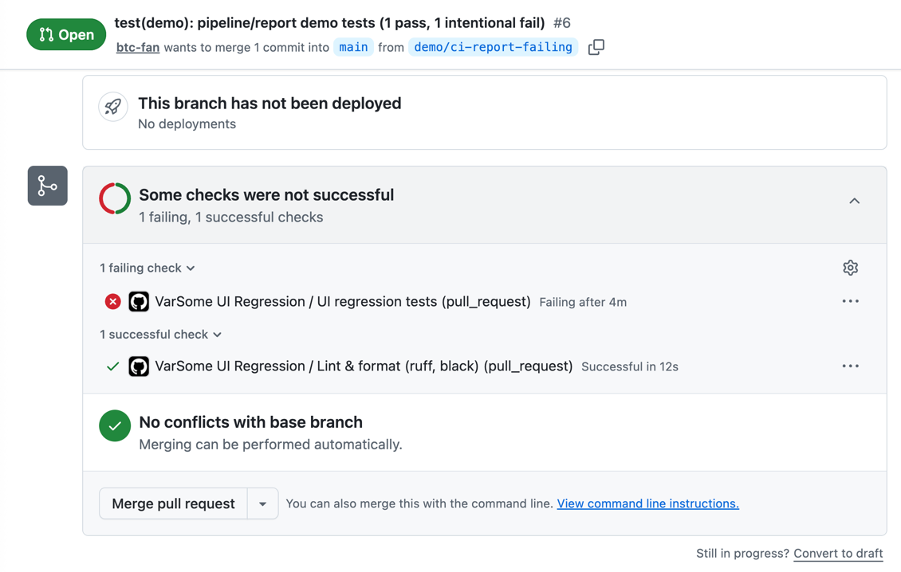
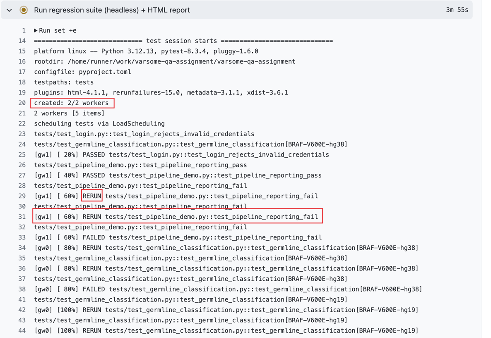
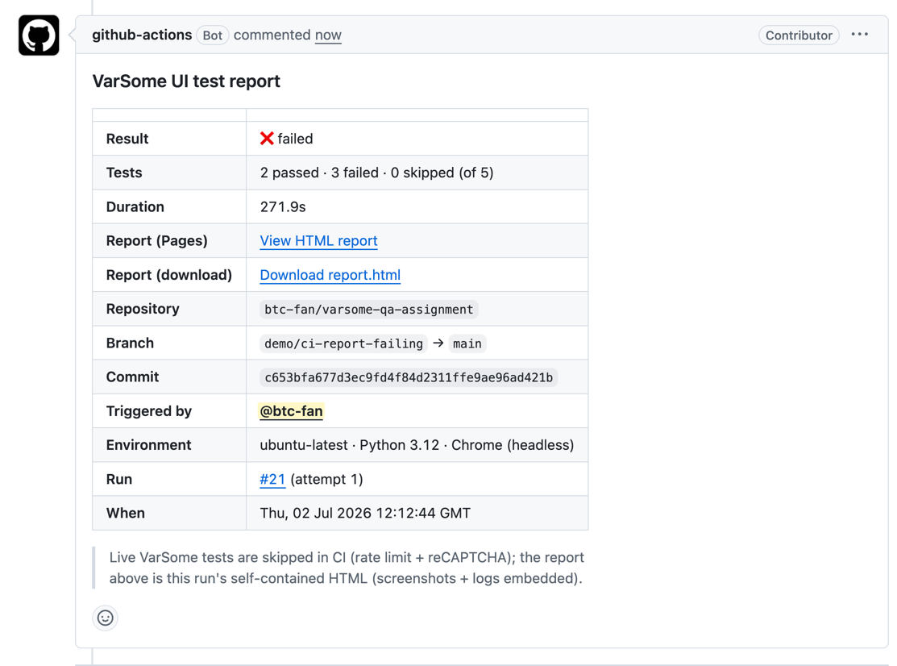
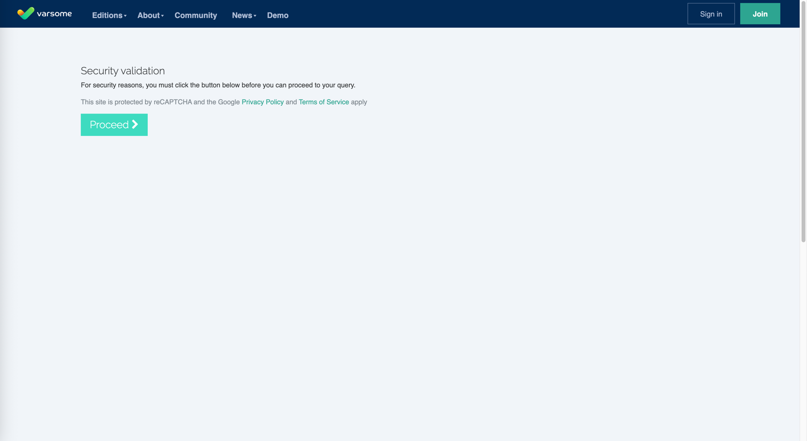
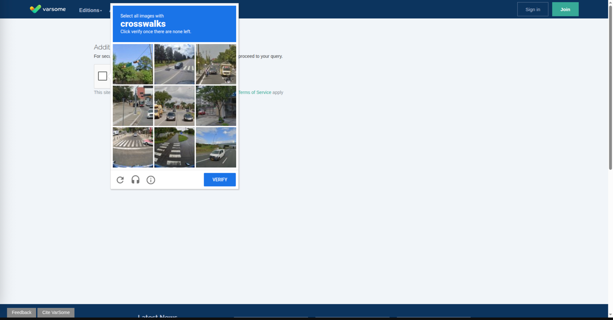
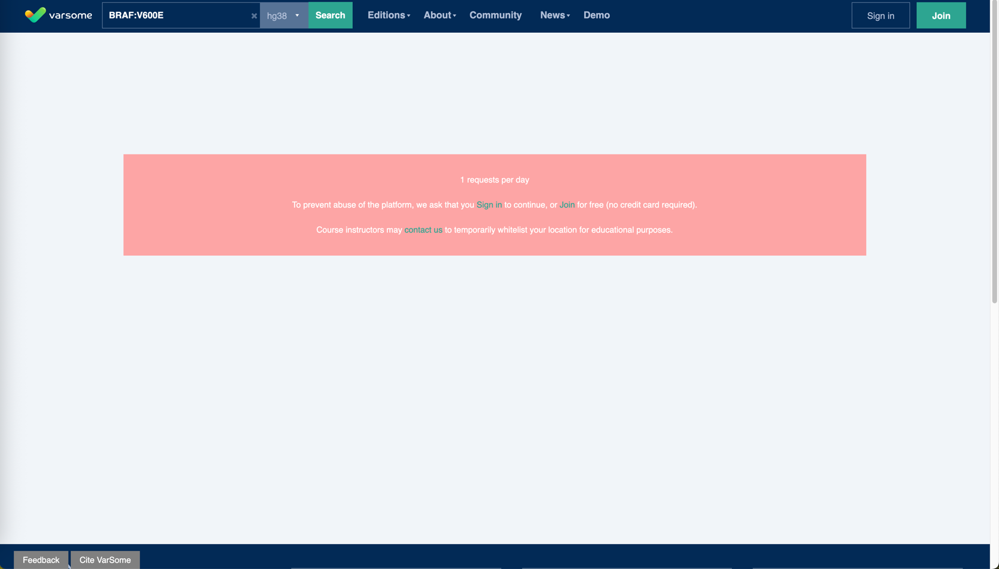
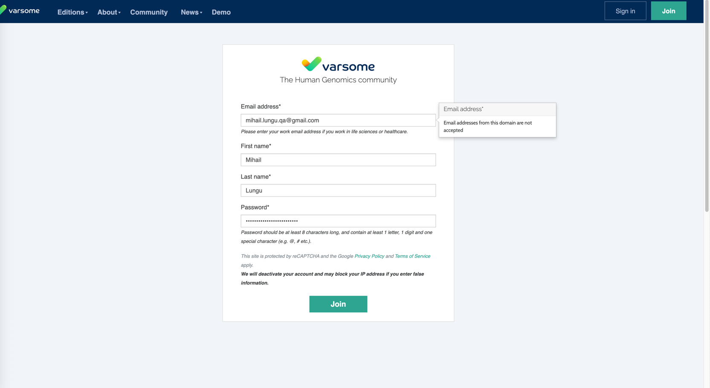

# VarSome — Germline Variant Classification Suite

UI automation for the QA task in [`task/`](task/) — *"Verification of Germline Variant
Classification for BRAF:V600E (hg38)"*. It confirms that VarSome classifies the germline
variant **BRAF:V600E** as **Pathogenic** (in red), with the expected **score** and
**interpretation**, after submitting defined sample information in the *Optional Sample
Information* modal and opening the detailed results page.

The full specification (six steps + expected results) is the PDF in [`task/`](task/).

## Tech stack

- **Python 3.10+**, **Selenium 4** (Selenium Manager — no manual driver binary)
- **pytest** + **pytest-xdist** (parallel) + **pytest-html** (report) + **pytest-rerunfailures**
- **Page Object Model**, `ruff` + `black` quality gate, GitHub Actions CI

## How it's built (the good parts)

- **Page Object Model** — pages expose behaviour and return values; selectors live only
  in `locators/locators.py`; data in `config/test_data.py`; config in `config/settings.py`.
- **Tests read like a story.** No control flow in test bodies (no `for`/`if`/try) — each
  step is one readable line a non-technical person can follow, and every step logs what
  it did, so a run reads like a narrative. All logic lives in page methods.
- **No fixed waits.** Only dynamic `WebDriverWait` + `expected_conditions` — never
  `time.sleep`, never implicit waits. Waits are on concrete post-conditions.
- **Isolated + parallel.** One fresh browser per test, no shared state, so tests run in
  parallel across **N workers** (`-n 2` by default; also in CI) via pytest-xdist.
- **Parametrized + tagged.** One data-driven test runs every scenario; markers
  (`smoke`, `regression`, `germline`, `login`) allow selective runs — a fast `-m smoke`
  gate or a full `-m regression`. Adding a variant/genome is a one-row edit in
  `GERMLINE_SCENARIOS`.

## Tests

| Test (id) | Tags | Scope | Runs? |
|-----------|------|-------|-------|
| `test_germline_classification[BRAF-V600E-hg38]` | smoke, regression, germline | Core happy path — the task's six steps end to end | Yes (may fail on live gates — see Issues) |
| `test_germline_classification[BRAF-V600E-hg19]` | regression, germline | Same flow on the hg19 build (genome coverage) | Yes (may fail on live gates) |
| `test_login_rejects_invalid_credentials` | login, regression | Negative auth — invalid creds rejected + exact error banner asserted | **Yes, always** (login page isn't rate-limited) |
| `test_login_with_valid_credentials` | login | Positive auth — valid creds sign in | **Skipped** unless `VARSOME_USER` / `VARSOME_PASSWORD` are set in `.env` |

**Why some don't always pass / are skipped**
- The positive login test is `skipif` — it needs a real account; we don't commit
  credentials, so it runs only when you supply them via `.env`.
- The germline tests are **not** skipped, but on repeated runs / datacenter IPs they can
  fail at VarSome's anti-bot gates (reCAPTCHA image challenge, or the "1 request per day"
  limit). That's a live-site constraint, not a test defect — see **Issues** below.

### What the germline test does (maps 1:1 to the task steps)

1. Launch VarSome and **select the genome build** (hg38 / hg19); assert the UI reflects it.
2. **Search** for `BRAF:V600E`.
3. Complete the **Optional Sample Information** modal (Germline): assert the Germline tab
   is active, fill Phenotype = *Cancer (MONDO:0004992)*, Sex = *Female*, Age = *60*,
   Ethnicity = *East Asian*, submit; assert the modal closes.
4. On the results page, assert **all 24 information cards** are present (General
   Information, Germline Classification, ClinVar, LOVD, PharmGKB, Publications, …) and
   each shows its expected stable content.
5. **Expand** the Germline Classification; assert the automated ACMG evidence rules
   (PS3, PM1, PP3, …) appear.
6. Assert the verdict is **Pathogenic**, rendered **red** (the pill's red background),
   with a positive ACMG **score** and a non-empty **interpretation**.

## Setup

```bash
python3 -m venv .venv
source .venv/bin/activate            # Windows: .venv\Scripts\activate
pip install -r requirements.txt
cp .env.example .env                  # adjust if needed
```

Chrome or Firefox must be installed. Selenium Manager resolves the driver automatically.

## Run

```bash
pytest                                # full suite, 2 parallel workers (default)
pytest -m smoke                       # smoke only (hg38)
pytest -m regression                  # regression (hg38 + hg19 + login-negative)
pytest -m login                       # auth tests
pytest -n 4                           # more parallel workers
```

Runs **headed** by default (`HEADLESS=false` in `.env`) because headless triggers the
reCAPTCHA gate (see Issues); CI runs headless.

## Report

A single self-contained **pytest-html** report — no Java, no external services.

- **`reports/report.html`** — self-contained; open the file directly.
- **Failure evidence**: on the failing step, `conftest.py` captures a **screenshot** and
  embeds it **inline** in the report, alongside the **full execution logs** (`log_cli`)
  — so you see exactly what happened and what data was used.
- **From CI**: the same HTML is uploaded as a **downloadable artifact** and published to
  **GitHub Pages** per run. Download the HTML to inspect the exact data used in that CI
  run for debugging, or share the Pages link with teammates.

## Continuous integration

GitHub Actions — workflow **VarSome UI Regression** (`.github/workflows/ci.yml`), on push
to `main` and every pull request:

- **quality-gate** — `ruff check` + `black --check`.
- **ui-tests** — install, run the regression suite (headless), build the HTML report,
  upload it as an artifact, publish it to the `gh-pages` branch, and post a **PR comment**
  with the result, the report link, and the branch / commit / environment / timestamp.
  The job is marked **red** if any test fails (reporting still runs first).

Each PR shows the checks by name (green/red):



Tests run in parallel (`-n 2` workers) with automatic reruns — from the "Run regression
suite" step:



### Demo PR

Demo PR: **[#6 — CI report demo](https://github.com/btc-fan/varsome-qa-assignment/pull/6)**
(branch `demo/ci-report-failing`). It carries two demonstration tests — **one passing,
one intentionally failing** — to show the pipeline end to end: the failing run still
**publishes the report** and **posts the PR comment**, and the CI job is correctly marked
**red**. It stays open as a living demo and is not merged.

The PR comment (result + shareable report link + run details):



The published report is hosted on GitHub Pages (shareable with teammates) and is also
downloadable from the run's artifacts, so anyone can open the HTML and see the exact data
used in that CI run — e.g. this demo run:
**[live report](https://btc-fan.github.io/varsome-qa-assignment/reports/demo/ci-report-failing/21/index.html)**.

## Issues (live prod, no test account)

We test against **production** VarSome as an anonymous user, so we hit every defensive
mechanism a real bot would. These are the reasons a run can fail when repeated:

### 1. CAPTCHA — sometimes a click, sometimes a hard block
After submitting the search there's a security gate. Usually it's **CAPTCHA 1**: a single
*Proceed* button we click. But intermittently CAPTCHA 1 escalates to **CAPTCHA 2**, a
Google reCAPTCHA "I'm not a robot" checkbox that can further demand an **image challenge**
(*"select all buses"*). An image challenge **cannot** be solved by automation — it is a
hard blocker. We tick the checkbox best-effort (headed Chrome often passes on a low risk
score), but with no test account there is no way around an image challenge.





**Important — a one-time manual solve unblocks the run.** If you solve the CAPTCHA once,
by hand, in the browser session, VarSome trusts that session and the tests then run
through cleanly. So a practical local workflow is: run headed, solve the CAPTCHA the one
time it appears, and let the suite continue — after that it proceeds without the gate.

### 2. IP rate limit — ~1 search result per day
After a couple of searches the IP is throttled: VarSome returns a **"1 request per day"**
banner instead of results. In practice only the **first** search-based test can pass per
day/IP; subsequent search tests fail on the missing results (not a code bug).



### 3. Can't register a test user — company-email only
To bypass the rate limit we tried creating an account, but registration **only accepts
company email domains** — a personal email is rejected. A dedicated testing email would
solve issues #1 and #2 (authenticated users skip the anti-bot gates and get a higher
quota). We accept this is production, not a test environment — fine for a home assignment.



## Things to improve (next)

- **Authenticated run**: a company/test account removes the reCAPTCHA + rate-limit gates,
  making the germline tests reliable and unattended in CI (login page objects are ready).
- **Negative / discriminating variant**: assert a known **Benign** variant is *not*
  Pathogenic / not red — proves the suite detects wrong verdicts, not just green paths.
- **Cross-browser**: add Firefox to the matrix (the driver factory already supports it).
- **Richer failure evidence**: also attach page source + browser console/network logs.
- **More assertions / areas**: exact ACMG score/points and specific evidence rules per
  variant; ClinVar star rating and significance; frequency values within tolerances;
  the left-blank modal fields staying empty; deep-linking straight to a variant URL.
